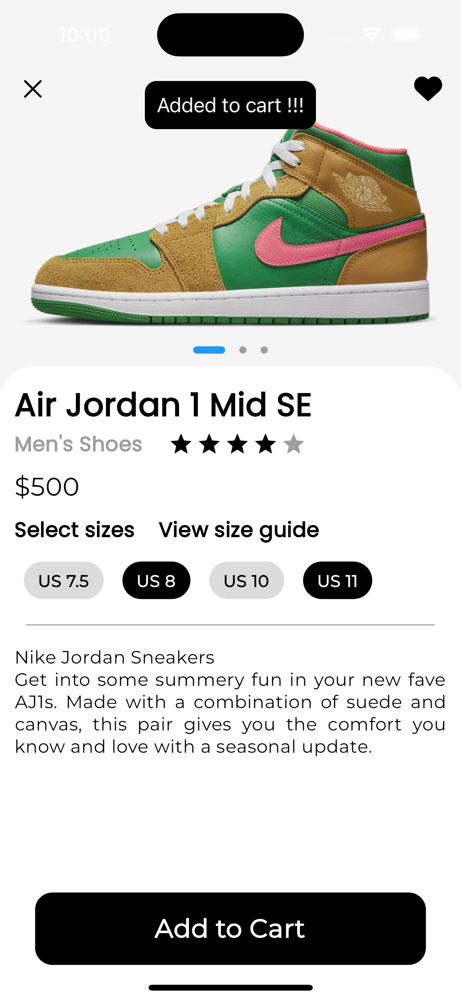

# iHun Shop

iHun Shop - Shoe Store: A stylish mobile app built for selling trendy shoes. Seamlessly integrated with a custom backend API

## Getting Started

This project is a starting point for a Flutter application.

A few resources to get you started if this is your first Flutter project:

Begin with the [Flutter Official Documentation](https://flutter.dev/docs/get-started/install)

- [Lab: Write your first Flutter app](https://docs.flutter.dev/get-started/codelab)

Check out Flutter’s online documentation for help getting started with your Flutter project.
- [Cookbook: Useful Flutter samples](https://docs.flutter.dev/cookbook)

For help getting started with Flutter development, view the
[online documentation](https://docs.flutter.dev/), which offers tutorials,
samples, guidance on mobile development, and a full API reference.

 ## Screenshots
       

## Development Setup

Create your custom api with [Strapi](https://strapi.io/) and [MongoDB](https://www.mongodb.com/)

Change urls to yours custom API

