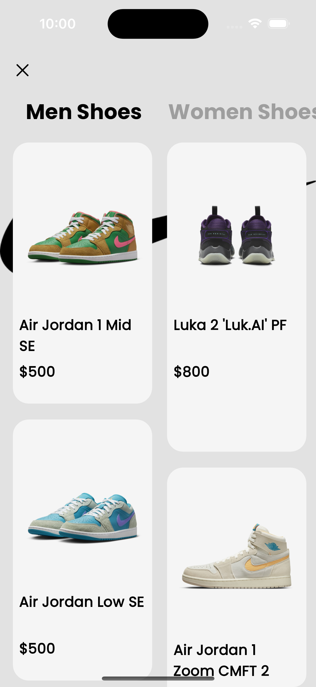

# iHun Shop

iHun Shop - Shoe Store: A stylish mobile app built for selling trendy shoes. Seamlessly integrated with a custom backend API

## Getting Started

This project is a starting point for a Flutter application.

A few resources to get you started if this is your first Flutter project:

- [Lab: Write your first Flutter app](https://docs.flutter.dev/get-started/codelab)
- [Cookbook: Useful Flutter samples](https://docs.flutter.dev/cookbook)

For help getting started with Flutter development, view the
[online documentation](https://docs.flutter.dev/), which offers tutorials,
samples, guidance on mobile development, and a full API reference.

 ## Screenshots
&nbsp;&nbsp;&nbsp;

## Development Setup

Change urls to yours custom API

Clone the repository and run the following commands:
```
flutter pub get
flutter run
```

